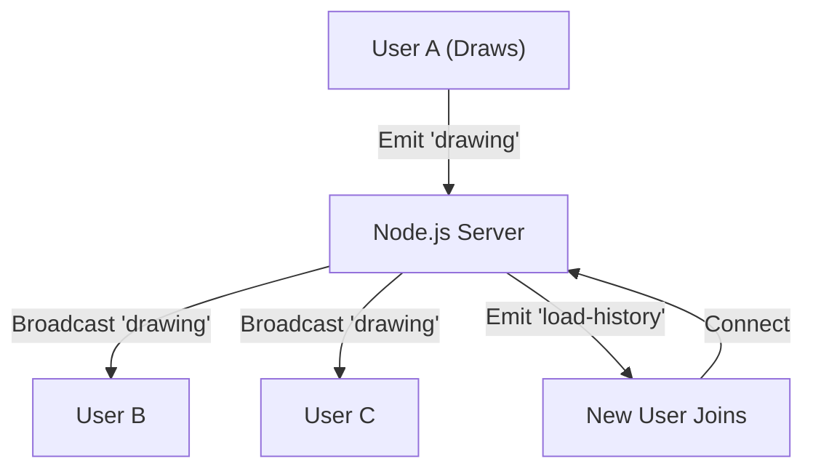

<div align="center">

# 🎨 ConnectBoard
### Real-Time Collaborative Whiteboard System


<p align="center">
  <strong>Synchronize ideas instantly.</strong><br>
  A low-latency collaborative drawing platform capable of handling multiple users simultaneously with shared state, history retention, and global event broadcasting.
</p>

[View Demo](#) · [Report Bug](#) · [Request Feature](#)

</div>

---

## 📖 Table of Contents
- [About the Project](#-about-the-project)
- [System Architecture](#-system-architecture)
- [Key Features](#-key-features)
- [Socket API Documentation](#-socket-api-documentation)
- [Getting Started](#-getting-started)
- [Engineering Challenges](#-engineering-challenges--solutions)
- [Future Roadmap](#-future-roadmap)

---

## 🔭 About the Project

**ConnectBoard** solves the problem of remote collaboration by providing a shared digital canvas. Unlike standard HTTP-based applications, this project utilizes **WebSockets** to maintain a persistent, bi-directional connection between all users.

This ensures that when User A draws a line, User B sees it in milliseconds, without refreshing the page. The system acts as a centralized "Source of Truth," managing the state of the board and distributing updates to connected clients efficiently.

### 🛠 Tech Stack
| Component | Technology | Role |
| :--- | :--- | :--- |
| **Frontend** | React.js | Component-based UI & DOM manipulation via Refs |
| **Graphics** | HTML5 Canvas | High-performance raster rendering |
| **Backend** | Node.js + Express | Server logic and static asset serving |
| **Real-Time** | Socket.io | WebSocket event handling and broadcasting |

---

## 🏗 System Architecture

The application follows a **Hub-and-Spoke** architecture where the server relays messages between clients.


> *Note: Data flow ensures that the sender does not receive their own broadcast to prevent feedback loops.*

---

## ✨ Key Features

* **⚡ Real-Time Synchronization:** Sub-100ms latency updates using `socket.broadcast`.
* **🎨 Multi-Color Support:** Dynamic state management for Red, Green, Blue, Black, and Eraser tools.
* **📜 History Retention:** Server-side memory array stores drawing vectors, allowing new users to "catch up" instantly upon joining.
* **🧹 Global Clear:** A "Nuke" button that utilizes `io.emit` to wipe the canvas for every connected user simultaneously.
* **📐 Responsive Design:** Canvas dynamically resizes to fit the browser window.

---

## 📡 Socket API Documentation

The core of the application relies on these specific event definitions.

### Client → Server Events
| Event Name | Payload Data | Description |
| :--- | :--- | :--- |
| `connection` | N/A | Triggered when a client opens the app. |
| `drawing` | `{ x0, y0, x1, y1, color }` | Coordinates of the line segment and its color. |
| `clear` | `null` | Command to wipe the board history. |

### Server → Client Events
| Event Name | Payload Data | Description |
| :--- | :--- | :--- |
| `load-history`| `Array<DrawingObject>` | Sent only to the **newly connected** user. |
| `drawing` | `{ x0, y0, x1, y1, color }` | Broadcast to **everyone except sender**. |
| `clear` | `null` | Broadcast to **everyone including sender**. |

---

## 🚀 Getting Started

### Prerequisites
* Node.js (v14 or higher)
* npm (Node Package Manager)

### Installation

1.  **Clone the Repository**
    ```bash
    git clone [https://github.com/yourusername/connectboard.git](https://github.com/yourusername/connectboard.git)
    cd connectboard
    ```

2.  **Setup the Backend (Server)**
    ```bash
    # From root directory
    npm install
    node server.js
    # Server runs on http://localhost:5000
    ```

3.  **Setup the Frontend (Client)**
    Open a new terminal window:
    ```bash
    cd client
    npm install
    npm start
    # Application runs on http://localhost:3000
    ```

---

## 🧠 Engineering Challenges & Solutions

During development, several critical concurrency and state management issues were solved.

### 1. The "Jumping Pen" Race Condition
* **Problem:** Using a global mouse position variable caused interference when multiple users drew simultaneously.
* **Solution:** Implemented **Atomic Line Segments**. Instead of tracking a continuous path, the app emits independent vectors (`{x0, y0} -> {x1, y1}`). This makes every stroke stateless and independent of other users' actions.

### 2. State Desynchronization (The "Sticky Color" Bug)
* **Problem:** If User A (Red) and User B (Blue) drew at the same time, the HTML Canvas context (`ctx.strokeStyle`) would sometimes "stick" to the wrong color.
* **Solution:** Transitioned to **Stateless Rendering**. Every data packet includes the color. The render function explicitly resets the context stroke style *before* every single draw operation, guaranteeing color accuracy.

### 3. Canvas "Amnesia"
* **Problem:** HTML5 Canvas clears its pixels when the window is resized.
* **Solution:** Implemented a **History Log** on the server. The server acts as a persistent memory store. When a client resizes or refreshes, the `load-history` event replays the entire session to restore the state.

---

## 🔮 Future Roadmap

- [ ] **Database Integration:** Move from in-memory array to **MongoDB** for permanent storage.
- [ ] **Room Support:** Allow users to generate private rooms (e.g., `/room/design-team`).
- [ ] **Snapshot Optimization:** Save Canvas as an image every 500 moves to reduce history replay time.
- [ ] **User Auth:** Add Google/GitHub login to identify who drew which line.

---

<div align="center">
  <sub>Built with ❤️ by Akshat.</sub>
</div>
